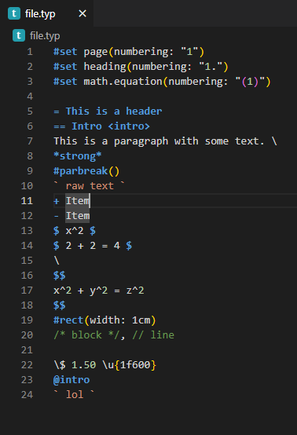
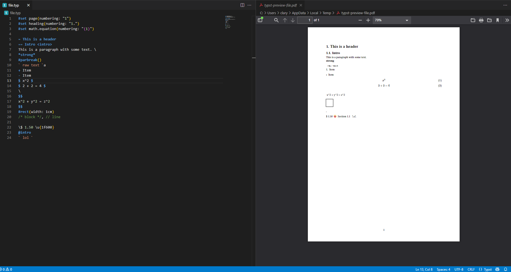

# typstlangsupport README

Wanted to make a extension for Typst .typ files similar to a markdown extension I use.

## Features

Has basic syntax highlighting wanting to improve edge cases.



Preview in PDF, PNG, SVG, and HTML (experimental) format using [Typst CLI compiler](https://github.com/typst/typst#usage), has alternate output options may use that instead



## Requirements

[Typst CLI](https://typst.app/)

[Click Here for Installation Steps](https://github.com/typst/typst#installation)

### Quick Start

+ Windows: ```winget install Typst.Typst```

+ macOS: ```brew install typst```

+ Linux: [Snapcraft](https://snapcraft.io/typst)

+ Cargo ([Rust](https://rustup.rs/)): 
    - the latest released Typst version with cargo install --locked typst-cli
    - a development version with cargo install --git https://github.com/typst/typst --locked typst-cli


## Install

- Download [typstlangsupport-{version}.vsix](https://github.com/TeejMcSteez/TypstVSCodeExt/blob/master/typstlangsupport-0.0.5.vsix)

- Go to Extensions Pane in VSCode or Cursor

- VSCode: Click Menu and add VSIX extension

- Cursor: Drag the vsix file to the extension pane

- Add typstlangsupport-{version}.vsix to your extension file

- You now have Typst language support!

## Extension Settings

Ctrl + Shift + V to preview .typ file
or
type `> Compile Typst to PDF and Preview` in the command palette

Edit output format in settings, options are pdf, png, svg, and html

## Known Issues

All regex edge cases have not been testing and therefore mileage may very with uses.

## Release Notes

+ Supports basic syntax highlighting
+ Supports preview compilation (not watchable currently) with `Ctrl+Shift+V`
+ Supports Cursor had to move vscode engine and types down to 1.96.0 from 1.99.0
+ Supports multiple output types in preview 
